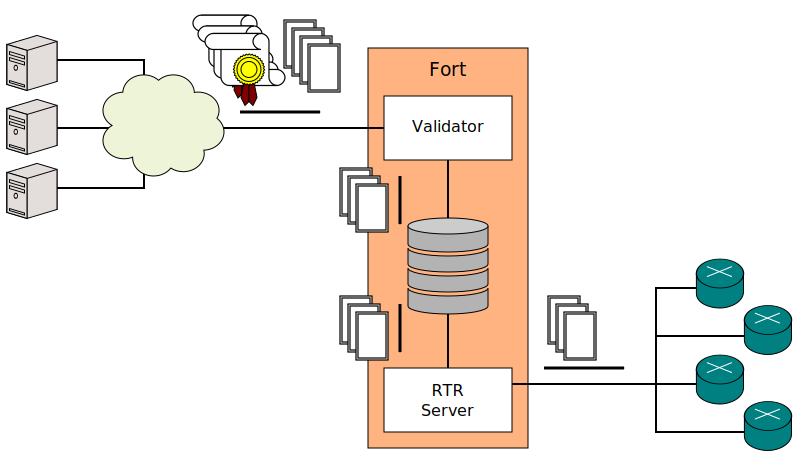

[Documentation](index.html) > {{ page.title }}

# {{ page.title }}

## Design

Fort is an MIT-licensed RPKI Relying Party. It is a service that performs the validation of the entire RPKI repository, and which serves the resulting ROAs for easy access by your routers.

The Validator is a timer that resynchronizes its [local cache](usage.html#--local-repository), validates the resulting [RPKI trees](intro-rpki.html) and stores the resulting ROAs in memory every [certain amount of time](usage.html#--servervalidation-interval). The RTR [Server](usage.html#--serveraddress) (which is part of the same binary) delivers these ROAs to any requesting routers.

Fort is a command line application intended for UNIX operating systems, written in C. (It requires a compiler that supports `-std=gnu11`.)

## Standards Compliance 

Further information can be found in the subsections below.

| RFC                                                                        | Implemented |
|----------------------------------------------------------------------------|-------------|
| [3779](https://tools.ietf.org/html/rfc3779) (IP & AS Extensions)           | 100%        |
| [6350](https://tools.ietf.org/html/rfc6350) (vCard)                        | 0%          |
| [6482](https://tools.ietf.org/html/rfc6482) (ROA)                          | 100%        |
| [6486](https://tools.ietf.org/html/rfc6486) (Manifests)                    | 75%         |
| [6487](https://tools.ietf.org/html/rfc6487) (Resource Certificates & CRLs) | 100%        |
| [6488](https://tools.ietf.org/html/rfc6488) (Signed Objects)               | 90%         |
| [6493](https://tools.ietf.org/html/rfc6493) (Ghostbusters)                 | 100%        |
| [7318](https://tools.ietf.org/html/rfc7318) (Policy Qualifiers)            | 100%        |
| [7730](https://tools.ietf.org/html/rfc7730) (TALs)                         | 100%        |
| [7935](https://tools.ietf.org/html/rfc7935) (RPKI algorithms)              | 100%        |
| [8182](https://tools.ietf.org/html/rfc8182) (RRDP)                         | 0%          |
| [8209](https://tools.ietf.org/html/rfc8209) (BGPSec Certificates)          | 100%        |
| [8360](https://tools.ietf.org/html/rfc8360) (Validation Reconsidered)      | 100%        |

### RFC 6350 (vCard)

The vCard format is only used by Ghostbusters records. 6350 defines the basic vCard format, while 6493 defines additional requirements for Ghostbusters-specific vCard.

The specific validations have been implemented, while the basic ones have not.

### RFC 6486 (Manifests)

This RFC states a bunch of rules that allow some level of tolerance to missing, invalid or stale manifests. Here's an example:

> signed objects (...) issued by the entity that has published the stale manifest (...) SHOULD be viewed as somewhat suspect, but MAY be used by the RP as per local policy.

These constitute the approximate missing 25%.

### RFC 6488 (Signed Objects)

6488 mandates that all signed objects must be DER-encoded. Fort's current parser cannot tell the difference between DER and (its superset) BER.

Unfortunately, the parser also currently unavoidably [rejects certain technically valid BER objects](https://github.com/vlm/asn1c/blob/master/skeletons/ber_decoder.c#L215-L221). (Although these are not valid DER.)

### RFC 8182 (RRDP)

RRDP is a protocol intended to replace RSYNC in the RPKI. Fort only implements RSYNC, currently.

## TO-DO

- Reach 100% RFC compliance
- Multithreading
- Daemon quirks (stuff like "send self to background automatically"), maybe
- More languages?
